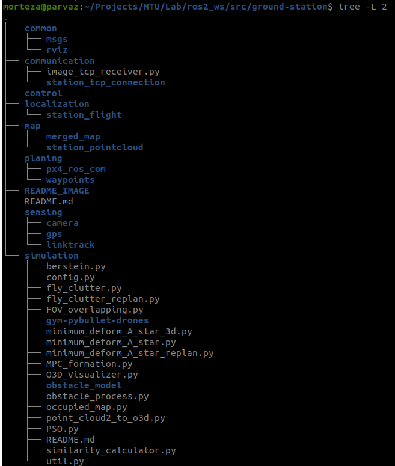

# ground-station-ROS2 Version
This repos is the core of source codes. Any changes here should be verified by all admins, before merging to main branch.

## Build

Always build the code with the below command. For example:
```
colcon build --symlink-install --cmake-args -DCMAKE_BUILD_TYPE=Release --packages-select realsense2_camera --allow-overriding realsense2_camera
```
Structure of ground-station repository is as follows:




To build station_tcp_connection and station_pointcloud packages these are needed to install below libraries first.
```
sudo apt install ros-humble-theora-image-transport

```
and 
```
sudo apt install ros-humble-pcl-ros

```