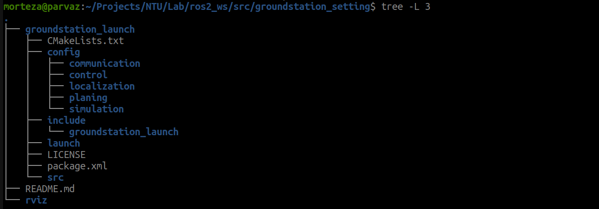

# Ground Station launch files
This repos is the core of launch files. Any changes here could be merged to main branch by users carefully.
In this repo only settings related to source codes should be changed through config folder and yaml files.

Below picture is subfolders tree 




## gazebo.param.yaml
There is variable to set number of agents to be used inside the gazebo. up to ten is tested.
```
cd src/groundstation_launch/config/simulation/gazebo.param.yaml
```
change below var:

```
n_agent
```
Initial position of each agent is set from script file which invoke from launch.py.

#Gazebo harmonic
In case gzclient or server didn't killed automatically use below command to kill the process:
```
pkill -f "gz sim"
```